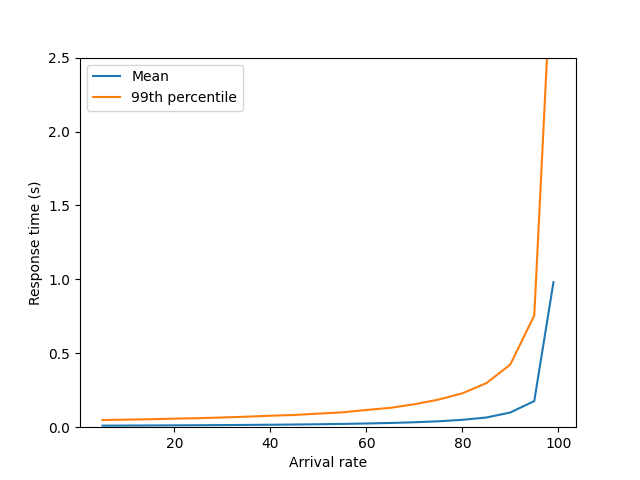
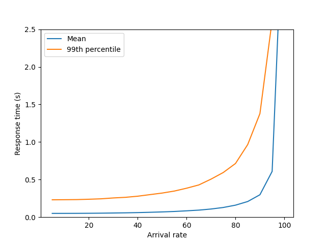
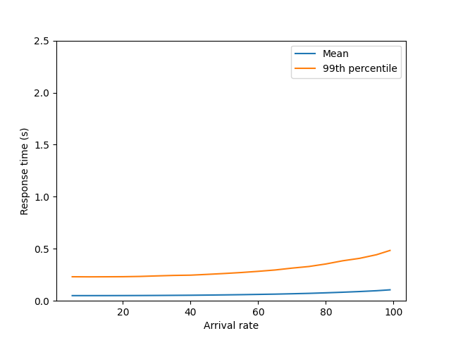
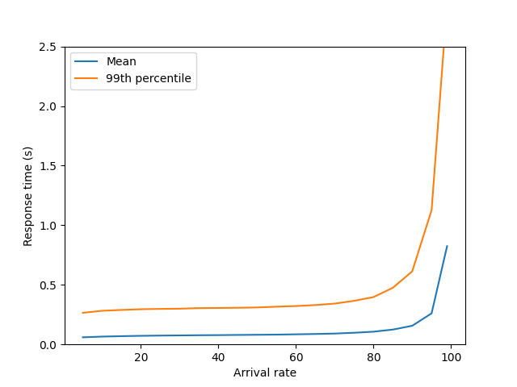
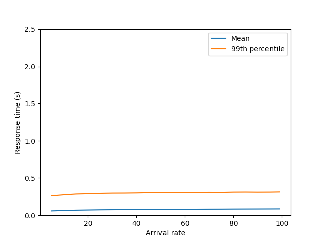

Lab report: Server farms and load balancing
===========================================

Results table
-------------

Fill out the table below to record the simulation results.

Response times (99th percentile) in milliseconds:

| Case                      | 10% utilization | 80% utilization | 90% utilization | 
|---------------------------|----------------:|----------------:|----------------:|
| Case 1: M/M/1             |              51 |             229 |             424 |
| Case 2: 5 servers, RR     |             231 |             738 |          13'353 |
| Case 3: 7 servers, overd. |             230 |             351 |             413 |
| Case 4: 5 servers, SFQ    |             282 |             397 |             613 |
| Case 4: 5 servers, CQ     |             279 |             315 |             317 |

Case 1: Base scenario: M/M/1 system
-----------------------------------

Insert the response time plot (mean and 99th percentile) for different utilization levels.

Answer the following questions:
- How does the mean response time change with the load?

At an arrival rate of 5, the mean response time is 0.011.
As the arrival rate increases to 99, the mean response time increases significantly to 0.981.
- How does the 99th percentile change with the load? 

At an arrival rate of 5, the 99th percentile response time is 0.048.
As the arrival rate increases to 99, the 99th percentile response time increases to 3.384.

Case 2: Load balancing with Round-Robin
---------------------------------------

Insert the response time plot (mean and 99th percentile) for different utilization levels.

Asnwer the following questions:

- Is this system a M/M/k system? Explain why.

No, this system is not a true M/M/k system. In an M/M/k system, there are k servers, each with the same service rate, and jobs are assigned to the first available server. In the round-robin load balancing system, requests are distributed to servers in a fixed cyclic order, which does not account for the current load on each server.

- How do the mean response time and the 99th percentile change with the load?

Both the mean response time and the 99th percentile response time increase as the load increases. This is because higher loads result in more requests being processed, leading to longer queues and increased waiting times.

- Compare the 99th percentile with the M/M/1 system at a low utilization level (e.g., 10%). What do you observe?

At a low utilization level (e.g., 10%), the 99th percentile response time for the load balancing system is higher than that of the M/M/1 system. This indicates that the load balancing system is less efficient at handling requests at low loads.

- Compare the 99th percentile with the M/M/1 system at a hight utilization level (e.g., 90%). What do you observe?

At a high utilization level (e.g., 90%), the 99th percentile response time for the load balancing system is significantly higher than that of the M/M/1 system. This shows that the load balancing system struggles more with high loads compared to the M/M/1 system.

- Why is the performance of the load balancing system worse than M/M/1 at low utilization levels?

The performance of the load balancing system is worse than M/M/1 at low utilization levels because the round-robin scheduling does not account for the current load on each server. This can lead to inefficient use of server resources and increased response times

- Why is the performance of the load balancing system worse tha M/M/1 at high utilization levels?

At high utilization levels, the round-robin scheduling can cause some servers to become overloaded while others are underutilized. This imbalance leads to longer queues and increased response times, making the load balancing system less efficient than the M/M/1 system.

Case 3: Overdimensioning RR
---------------------------

In case 2 we've simulated a load balancing system where each servers has 1/5 of the capacity of the single server in the M/M/1 system. We've observed that the load balancing system is less efficient.

- How many servers are needed, such that the load balancing system has the same 99th percentile response time as the M/M/1 system at 90% utilization?

To achieve the same 99th percentile response time as the M/M/1 system at 90% utilization (0.424 seconds), you need 7 servers in the load balancing system. This configuration meets the target 99th percentile response time.

Show the plot with the response times for this configuration here and interpret the results.

- Increasing the number of servers improves the performance of the load balancing system for *high loads*. Is it possible to improve the performance for *low loads* as well?

To improve the performance for low loads, consider implementing more efficient load balancing algorithms such as Shortest-Queue-First or Central Queue.

Case 4: Improving the load balancing system
------------------------------------------

Describe the results obtained from the two algorithms (shortest-queue-first and central queue). How do they compare with the round-robin scheduling and with the M/M/1 system?

Shortest-Queue-First (SFQ):  
- Performance: The SFQ algorithm shows better performance than round-robin scheduling, especially at higher utilization levels. By directing requests to the server with the shortest queue, it balances the load more effectively, reducing response times.
- Comparison with Round-Robin: SFQ has lower response times compared to round-robin, particularly at 80% and 90% utilization levels.
- Comparison with M/M/1: SFQ improves over round-robin but does not match the efficiency of the M/M/1 system, which is optimal for a single server scenario.

Central Queue (CQ):  
- Performance: The CQ algorithm significantly improves performance by maintaining a central queue and assigning requests to the first available server. This method ensures that no server is idle while there are pending requests.
- Comparison with Round-Robin: CQ outperforms round-robin by a considerable margin, showing much lower response times across different utilization levels.
- Comparison with M/M/1: The CQ algorithm comes closer to the performance of the M/M/1 system, especially at higher loads, due to its efficient handling of requests and better utilization of server resources.

Case 5: Mixing servers
----------------------

This case considers a mix of a fast and slower server. 

Provide your answers to the questions for the mixed server configuration.

- If you only consider the throughput, which configuration is better: only the fast server, or both servers?

The configuration with both servers will have a higher combined throughput than using only the fast server. This is because the combined service rate of both servers is higher than the service rate of the fast server alone.  
Fast server only: (\mu_1 = 100) requests per second.
Both servers: (\mu_1 + \mu_2 = 100 + 20 = 120) requests per second.
Thus, the configuration with both servers has a higher throughput.

- Can you find a configuration where the response time is better with only the fast server?

Using only the fast server ((\mu_1 = 100)) will generally result in lower response times, especially under high load, because there is no slower server to introduce delays.

- Can you find a configuration where the response time is better with both servers?

Using both servers with a round-robin scheduling where the fast server receives 5 times more requests than the slow server can improve the response time under certain conditions, particularly when the load is not too high. However, the slower server can still introduce delays.

Conclusion
----------

Document your conclusions here. What did you learn from the simulation results?

The simulation results highlight several key findings. The M/M/1 system, with a single fast server, demonstrates efficient handling of requests with lower response times at both low and high utilization levels. In contrast, the round-robin scheduling algorithm is less efficient, resulting in higher response times, especially at high utilization levels, due to its fixed cyclic order of request distribution.  More sophisticated algorithms like Shortest-Queue-First (SFQ) and Central Queue (CQ) significantly improve performance over round-robin by better balancing the load and reducing response times. The CQ algorithm, in particular, comes closest to matching the performance of the M/M/1 system. Additionally, using both fast and slow servers can increase overall throughput, but the response time is generally better with only the fast server, especially under high load. These findings underscore the importance of selecting an appropriate load balancing algorithm and server configuration to optimize server farm performance.